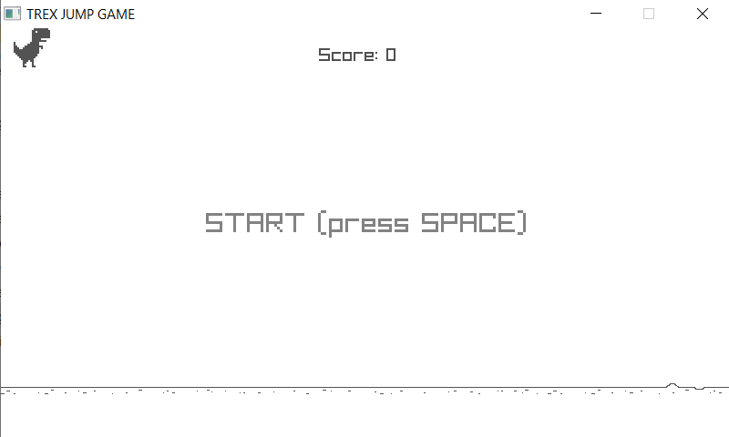
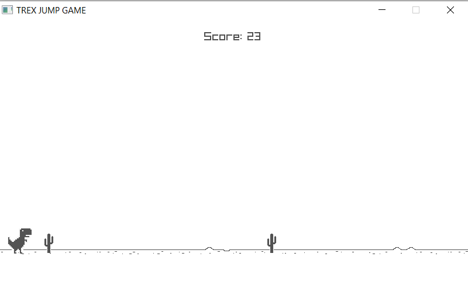
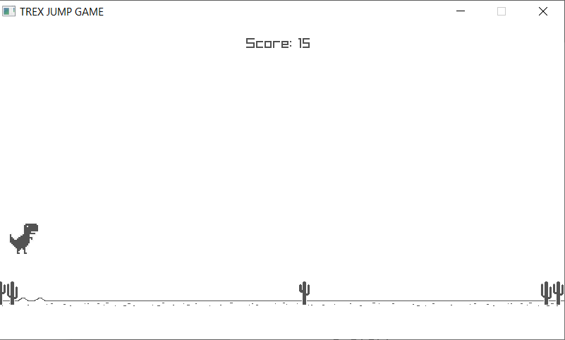
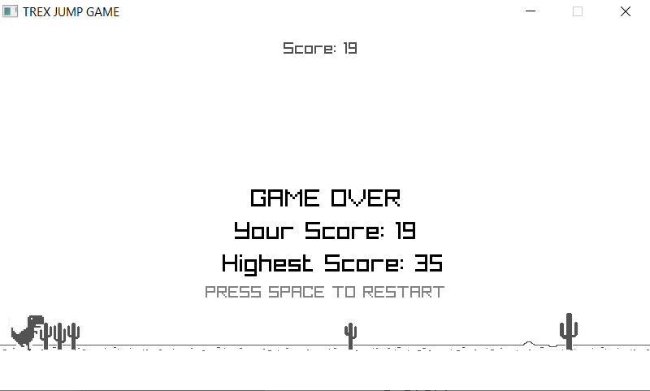

# jump_game

jump_game is a game developed with raylib.h and c programming language.

## Building the game

example cmake commands for Windows minGW

```bash
cmake -G "MinGW Makefiles" -B build
cmake --build build
cd build
./jump_game
```

## Some Images




